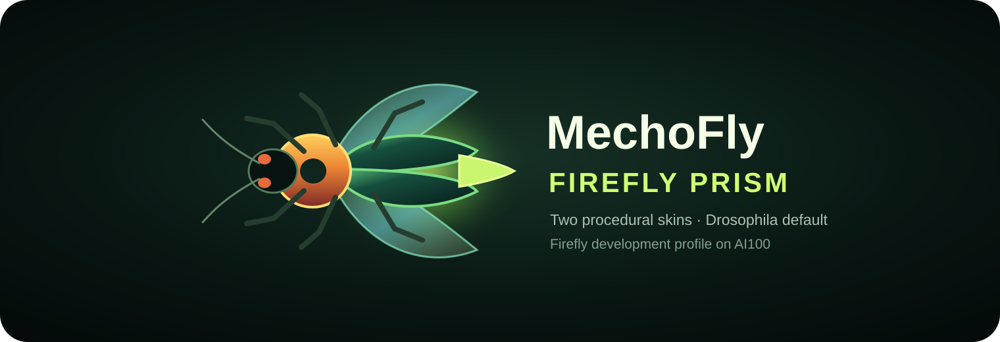

# MechoFly

<p align="center">
  
</p>

MechoFly is a Rust desktop companion and transparent connectome-model lab. It
combines an animated procedural pet, deterministic modeled neural dynamics,
automatic CPU/GPU capacity calibration, bounded replay, aligned multi-frame
actual-versus-alternative comparison, and an explicitly authored stimulation
preview.

The application has two presentation-only skins:

- **Drosophila Natural** is the repository and application default.
- **Firefly Lantern** is the alternate skin and AI100 machine-profile default.

Skins never change graph structure, dynamics, replay, learning, or scientific
claims.

## What is scientifically claimed

MechoFly keeps four layers separate:

1. an imported graph is `DERIVED_CONNECTOME_STRUCTURE`;
2. neural activity is `MODELED_NEURAL_DYNAMICS`, never a recording;
3. pet adaptation is `MODELED_SOFTWARE_LEARNING` from explicit feedback;
4. skins and motion are `AUTHORED_PRESENTATION`.

The FlyWire connectome is a structural wiring diagram, not a complete dynamics
or learning model. The first learning layer is therefore a bounded contextual
pet policy stored outside the connectome. It can be disabled, reset, exported,
or deleted. It never rewrites connectome edges and is not labeled as biological
synaptic plasticity.

## CPU, Radeon, Intel, and NVIDIA

MechoFly benchmarks CPU at every startup and also benchmarks the active
compute-capable GPU when one exists. `Auto` selects the faster exact-matching
backend and the largest named model tier projected to stay inside the model
step budget. With no suitable GPU, the same application runs on CPU.

GPU work uses portable WGSL through `wgpu`; there is no CUDA dependency and no
vendor allowlist. Brain Lab's **Re-evaluate capacity** button repeats the
benchmarks and starts a new identified session if the backend or tier changes.

## Brain Lab v3

Double-click or right-click the pet, or use its tray menu, to open Brain Lab.
The dark Neural Observatory interface has:

- a compact left model/replay dock with automatic CPU/GPU re-evaluation;
- a central bilateral population field or aligned two-row comparison filmstrip;
- a counterfactual composer beside the comparison it authors;
- a right trust layer with exact identities, claims, and lookup; and
- a compact bottom activity/behavior timeline and event line.

On Windows the pet is not an `eframe` swap-chain window. Rust supplies a small
premultiplied BGRA bitmap to the native layered-window compositor, so zero-alpha
pixels are real desktop holes and no black rectangle or chroma key is exposed.
All visible pet controls live in the tray; the desktop surface contains only
the fly.

A valid preview targets at most 64 unique neurons, has amplitude in `(0, 0.25]`,
lasts 33–990 ms, stays under a dosage ceiling, and runs on a full deep clone of
a retained checkpoint. There is no apply or commit path. Its receipt proves the
live digest did not change.

## Build and run on Windows

Requirements:

- Windows 10 or 11, x64;
- Windows PowerShell 5.1 or newer; and
- stable Rust with Cargo (Rust 1.95 or newer).

```powershell
Set-ExecutionPolicy -Scope Process Bypass
.\host-windows\build.ps1
.\host-windows\Start-MechoFly.ps1
```

Useful launch options:

```powershell
.\host-windows\Start-MechoFly.ps1 -Skin drosophila -Compute auto
.\host-windows\Start-MechoFly.ps1 -Skin firefly -Compute cpu -BrainLab
.\host-windows\Start-MechoFly.ps1 -Compute gpu -ReducedMotion
```

An unavailable explicitly requested GPU falls back visibly to CPU. `Auto` is
the normal setting.

## FlyWire FAFB v783

MechoFly does not bundle or redistribute connectome data. After agreeing to the
FlyWire citation guidelines and principles, download the filtered connection
table from Codex and choose the local CSV or CSV.GZ path in Brain Lab. Import
records the source URL, snapshot, column mapping, SHA-256, transform, counts,
and validation warnings before starting a pinned imported-graph session.

## AI100

`tools\Setup-AI100-MechoFly.ps1` synchronizes the clean `main` checkout at
`D:\Projects\MechoFly`, writes the machine-local Firefly/Auto profile, builds
the Rust executable, runs the safety self-test, and maintains the Start, Stop,
and Emergency Stop shortcuts.

```powershell
.\tools\Setup-AI100-MechoFly.ps1 -Launch
```

See [architecture](docs/ARCHITECTURE.md),
[compute profiles](docs/COMPUTE_PROFILES.md),
[Brain Lab v3](docs/BRAIN_LAB_V3.md),
[connectome and learning](docs/LEARNING_AND_CONNECTOME.md),
[data provenance](docs/DATA_PROVENANCE.md), and
[AI100 setup](docs/AI100.md).
